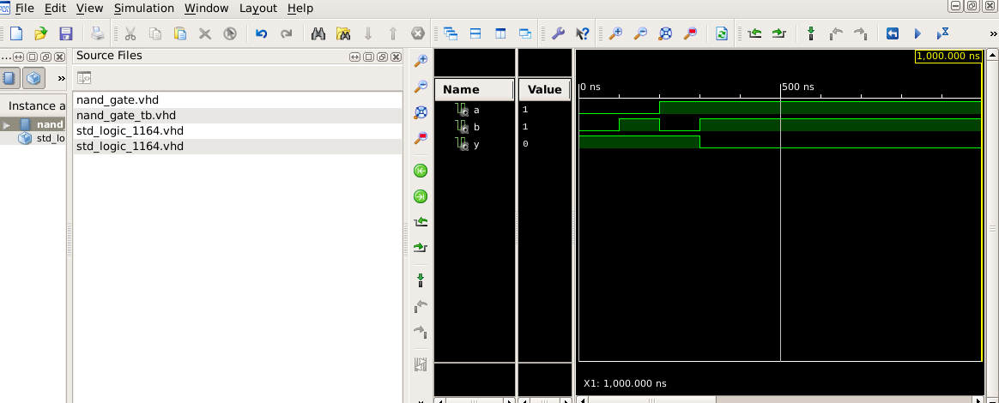
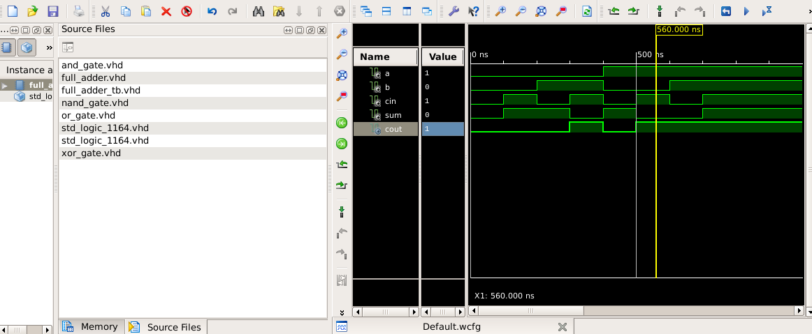
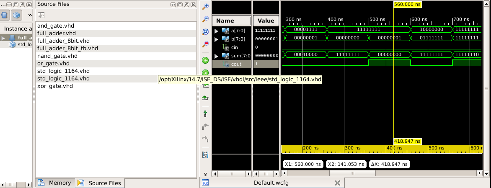

# Intro-to-VLSI
A bottom-up VLSI and computer architecture project using AMD Xilinx Vivado. Documents a day-by-day journey from fundamental logic gates up to a custom CPU architecture, beginning with initial lab milestones in combinational arithmetic circuits.
# Custom CPU Design Journey: From Logic Gates to Architecture

Welcome to my VLSI and digital system design repository! This project documents my step-by-step journey of building a custom CPU architecture from scratch using *AMD Xilinx Vivado*. 

Rather than jumping straight into a complex system, this repository follows a structured, bottom-up design methodology. I am designing and verifying every digital block day by day, starting from basic universal gates, moving to complex arithmetic units, and ultimately integrating them into a fully functional microprocessor pipeline for my course final project.

---

## 🛠️ Design Environment
* *Hardware Description Language:* Verilog / SystemVerilog
* *Development Suite:* AMD Xilinx Vivado Design Suite
* *Verification Tool:* Vivado Simulator (XSIM) for behavioral testing

---

## 🚀 Active Milestones: The Building Blocks
Below are the foundational digital circuits implemented in the opening phases of the project. Each module includes the clean RTL source code alongside verified simulation waveforms.

### 🔹 Milestone 1: The Primitive NAND Gate
The universal building block for the entire digital system. All future logic structures can be derived from this baseline gate.
* *Status:* Completed & Verified
* *RTL View:* Look inside the source files to see the structural logic code.
* *Simulation Waveform:* 
   (Upload your Vivado simulation screenshot here)

### 🔹 Milestone 2: 1-Bit Full Adder
Moving from basic logic to combinational arithmetic. This circuit computes the sum and carry-out of three input bits.
* *Status:* Completed & Verified
* *Simulation Waveform:* 
  

### 🔹 Milestone 3: 8-Bit Adder
Chaining 1-bit components structurally to handle multi-bit binary math. This represents the baseline for the future Arithmetic Logic Unit (ALU).
* *Status:* Completed & Verified
* *Simulation Waveform:* 
  

---

## 📈 Future Architecture Roadmap
As this course progresses, new modules will be designed, tested, and added to this repository:
1. *Sequential Logic & Storage:* Registers, Shift Registers, and a Multi-word Register File.
2. *Arithmetic Logic Unit (ALU):* A multi-functional block combining math and bitwise operations.
3. *Control Unit & Program Counter:* The brain of the processor that fetches and decodes instructions.
4. *Top-Level CPU Integration:* Chaining the Data Path and Control Unit together into the final operational CPU.
