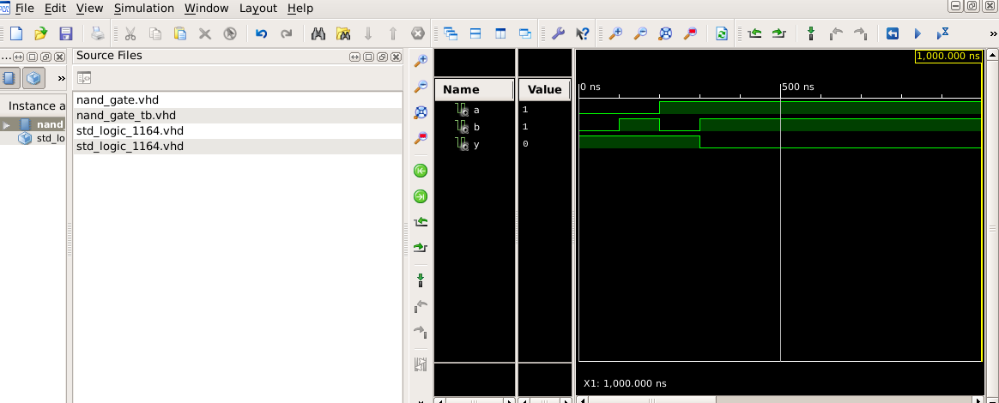
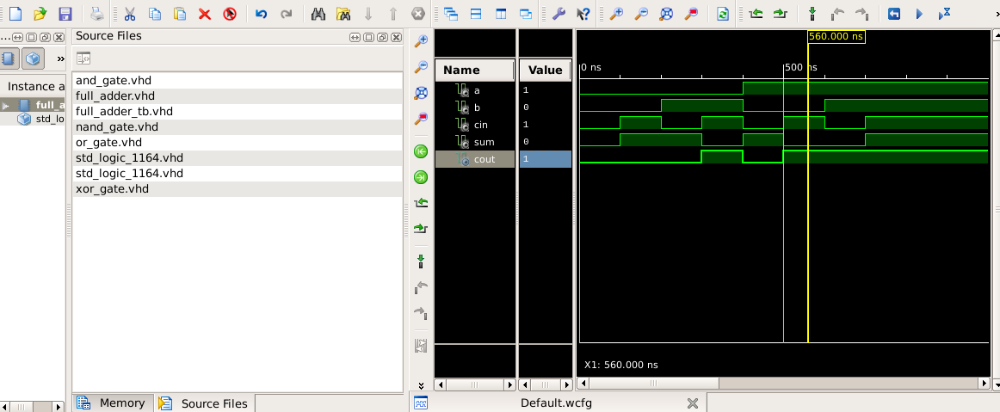
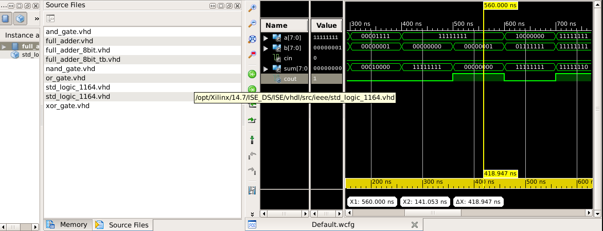
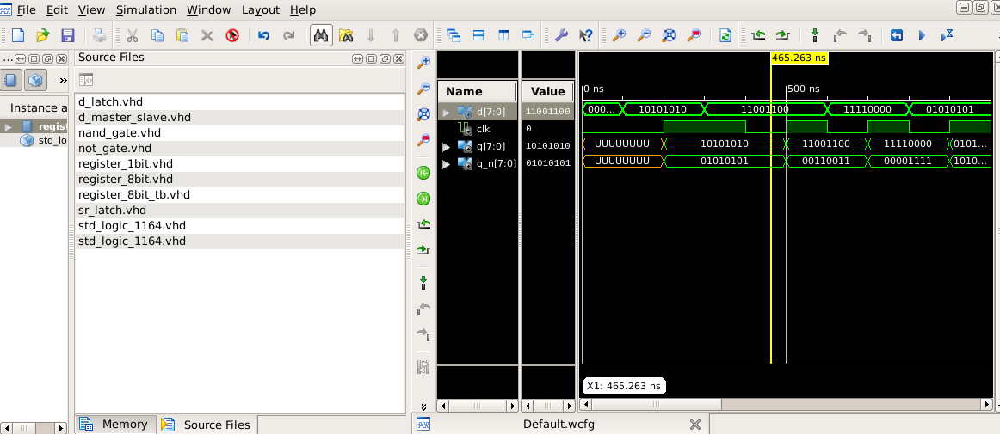

# Intro-to-VLSI

A bottom-up VLSI and computer architecture project using **AMD Xilinx Vivado**. This repository documents a day-by-day journey from fundamental logic gates to a custom CPU architecture, beginning with basic digital circuits and combinational arithmetic units.

# Custom CPU Design Journey: From Logic Gates to Architecture

Welcome to my VLSI and digital system design repository! This project documents my step-by-step journey of building a custom CPU architecture from scratch using **AMD Xilinx Vivado**.

Rather than jumping straight into a complex system, this repository follows a structured, bottom-up design methodology. I am designing and verifying every digital block step by step, starting from basic universal gates, moving to combinational arithmetic circuits, sequential logic, storage elements, and eventually integrating these components into a complete CPU architecture for my course final project.

---

## 🛠️ Design Environment

* **Hardware Description Language:** VHDL
* **Development Suite:** AMD Xilinx Vivado
* **Simulation Tool:** Vivado Simulator (XSIM)
* **Design Methodology:** Bottom-Up Structural Design

---

# 🚀 Active Milestones: The Building Blocks

Below are the digital circuits implemented during the opening phases of the project. Each module is designed, simulated, and verified before being used as a building block for a larger circuit.

---

## 🔹 Milestone 1: Primitive NAND Gate

The NAND gate is the universal building block for the initial logic design. The following logic gates are constructed using previously designed NAND gates.

**Status:** Completed & Verified

### Truth Table

| A | B | Y = A NAND B |
| - | - | ------------ |
| 0 | 0 | 1            |
| 0 | 1 | 1            |
| 1 | 0 | 1            |
| 1 | 1 | 0            |

### Simulation



---

## 🔹 Milestone 2: NOT Gate

The NOT gate is constructed using the previously designed NAND gate.

**Status:** Completed & Verified

### Truth Table

| A | Y |
| - | - |
| 0 | 1 |
| 1 | 0 |

---

## 🔹 Milestone 3: AND Gate

The AND gate is structurally constructed using NAND gates.

**Status:** Completed & Verified

### Truth Table

| A | B | Y = A AND B |
| - | - | ----------- |
| 0 | 0 | 0           |
| 0 | 1 | 0           |
| 1 | 0 | 0           |
| 1 | 1 | 1           |

---

## 🔹 Milestone 4: OR Gate

The OR gate is structurally constructed using NAND gates.

**Status:** Completed & Verified

### Truth Table

| A | B | Y = A OR B |
| - | - | ---------- |
| 0 | 0 | 0          |
| 0 | 1 | 1          |
| 1 | 0 | 1          |
| 1 | 1 | 1          |

---

## 🔹 Milestone 5: XOR Gate

The XOR gate is constructed using previously designed NAND-based logic.

**Status:** Completed & Verified

### Truth Table

| A | B | Y = A XOR B |
| - | - | ----------- |
| 0 | 0 | 0           |
| 0 | 1 | 1           |
| 1 | 0 | 1           |
| 1 | 1 | 0           |

---

# ➕ Combinational Arithmetic

## 🔹 Milestone 6: 1-Bit Full Adder

The 1-bit full adder takes two input bits and a carry input and produces a sum and carry output.

**Status:** Completed & Verified

### Truth Table

| A | B | Cin | SUM | Cout |
| - | - | --- | --- | ---- |
| 0 | 0 | 0   | 0   | 0    |
| 0 | 0 | 1   | 1   | 0    |
| 0 | 1 | 0   | 1   | 0    |
| 0 | 1 | 1   | 0   | 1    |
| 1 | 0 | 0   | 1   | 0    |
| 1 | 0 | 1   | 0   | 1    |
| 1 | 1 | 0   | 0   | 1    |
| 1 | 1 | 1   | 1   | 1    |

### Simulation



---

## 🔹 Milestone 7: 8-Bit Adder

The 8-bit adder is constructed by cascading eight 1-bit full adders. It provides the basic arithmetic foundation for the future ALU.

**Status:** Completed & Verified

### Example Test Cases

| A        | B        | Cin | SUM      | Cout |
| -------- | -------- | --- | -------- | ---- |
| 00000000 | 00000000 | 0   | 00000000 | 0    |
| 00000001 | 00000001 | 0   | 00000010 | 0    |
| 00000101 | 00000011 | 0   | 00001000 | 0    |
| 00001111 | 00000001 | 0   | 00010000 | 0    |
| 11111111 | 00000001 | 0   | 00000000 | 1    |
| 10101010 | 01010101 | 0   | 11111111 | 0    |
| 11110000 | 00001111 | 0   | 11111111 | 0    |
| 11111111 | 11111111 | 0   | 11111110 | 1    |

### Simulation



---

# 🔄 Sequential Logic & Storage

After completing the combinational circuits, the project moves into sequential logic. These circuits introduce memory and allow the system to store information.

---

## 🔹 Milestone 8: SR Latch

The SR latch is constructed using two cross-coupled NAND gates.

Because this implementation uses NAND gates, the S and R inputs are **active-low**.

**Status:** Completed & Verified

### Truth Table

| S | R | Q (Next) | Operation |
| - | - | -------- | --------- |
| 1 | 1 | Q        | Hold      |
| 0 | 1 | 1        | Set       |
| 1 | 0 | 0        | Reset     |
| 0 | 0 | Invalid  | Invalid   |

---

## 🔹 Milestone 9: D Latch

The D latch is constructed using the previously designed:

* NOT gate
* NAND gates
* SR latch

**Status:** Completed & Verified

### Truth Table

| ENABLE | D | Q (Next) | Operation |
| ------ | - | -------- | --------- |
| 0      | 0 | Q        | Hold      |
| 0      | 1 | Q        | Hold      |
| 1      | 0 | 0        | Store 0   |
| 1      | 1 | 1        | Store 1   |

When `ENABLE = 1`, the latch follows the input `D`.

When `ENABLE = 0`, the latch holds its previous value.

### Simulation


---

## 🔹 Milestone 10: SR Flip-Flop

The SR flip-flop provides clock-controlled storage based on Set and Reset inputs.

**Status:** Completed & Verified

### Behavior Table

| CLK | S | R | Q (Next) | Operation |
| --- | - | - | -------- | --------- |
| 0   | X | X | Q        | Hold      |
| 1   | 0 | 0 | Q        | Hold      |
| 1   | 0 | 1 | 0        | Reset     |
| 1   | 1 | 0 | 1        | Set       |
| 1   | 1 | 1 | Invalid  | Invalid   |

`X` means the input is not relevant while the clock is inactive.

---

## 🔹 Milestone 11: D Flip-Flop

The D flip-flop stores the value of `D` at the active clock transition.

**Status:** Completed & Verified

### Behavior Table

| Clock                | D | Q (Next) | Operation |
| -------------------- | - | -------- | --------- |
| No active transition | 0 | Q        | Hold      |
| No active transition | 1 | Q        | Hold      |
| Active transition    | 0 | 0        | Store 0   |
| Active transition    | 1 | 1        | Store 1   |

Unlike a D latch, the output does not continuously follow the input. The input is captured at the clock transition.

---

## 🔹 Milestone 12: D Master-Slave Flip-Flop

The Master-Slave D flip-flop is constructed using two D latches.

* **Master:** Enabled when `CLK = 0`
* **Slave:** Enabled when `CLK = 1`
* The Master captures the input first.
* The Slave transfers the stored value to the output.

**Status:** Completed & Verified

### Behavior Table

| CLK | D | Master     | Q (Next) | Operation     |
| --- | - | ---------- | -------- | ------------- |
| 0   | 0 | Captures 0 | Q        | Master active |
| 0   | 1 | Captures 1 | Q        | Master active |
| 1   | 0 | Hold       | 0        | Slave active  |
| 1   | 1 | Hold       | 1        | Slave active  |

### Structure

```text
             ┌──────────────────┐
D ──────────►│   Master D Latch │
             │   ENABLE = CLK'  │
             └────────┬─────────┘
                      │
                      ▼
             ┌──────────────────┐
CLK ────────►│    Slave D Latch │
             │    ENABLE = CLK  │
             └────────┬─────────┘
                      │
                      ▼
                      Q
```

---

# 💾 Registers

## 🔹 Milestone 13: 1-Bit Register

The 1-bit register is constructed using one D Master-Slave Flip-Flop.

**Status:** Completed & Verified

### Behavior Table

| D | Clock Event       | Q (Next) | Operation |
| - | ----------------- | -------- | --------- |
| 0 | Hold              | Q        | Hold      |
| 1 | Hold              | Q        | Hold      |
| 0 | Active transition | 0        | Store 0   |
| 1 | Active transition | 1        | Store 1   |

---

## 🔹 Milestone 14: 4-Bit Register

A 4-bit register can be constructed by connecting four 1-bit registers to a common clock.

**Status:** Structural Design

### Behavior Table

| D[3:0] | Clock Event       | Q[3:0] (Next) |
| ------ | ----------------- | ------------- |
| 0000   | Hold              | Q             |
| 0101   | Hold              | Q             |
| 1010   | Hold              | Q             |
| 1111   | Hold              | Q             |
| 0000   | Active transition | 0000          |
| 0101   | Active transition | 0101          |
| 1010   | Active transition | 1010          |
| 1111   | Active transition | 1111          |

---

## 🔹 Milestone 15: 8-Bit Register

The 8-bit register is constructed using **eight 1-bit registers sharing a common clock**.

This moves the project from individual storage elements to storing a complete 8-bit data word.

**Status:** Completed & Verified

### Behavior Table

| D[7:0]   | Clock Event       | Q[7:0] (Next) |
| -------- | ----------------- | ------------- |
| 00000000 | Hold              | Q             |
| 10101010 | Hold              | Q             |
| 11001100 | Hold              | Q             |
| 11110000 | Hold              | Q             |
| 10101010 | Active transition | 10101010      |
| 11001100 | Active transition | 11001100      |
| 11110000 | Active transition | 11110000      |
| 01010101 | Active transition | 01010101      |

### Simulation



---

# 🧩 Current Bottom-Up Design Hierarchy

The current project follows a bottom-up design methodology where each larger circuit is constructed from previously designed components.

```text
                    ┌───────────────┐
                    │   NAND Gate   │
                    └───────┬───────┘
                            │
              ┌─────────────┼─────────────┐
              ▼             ▼             ▼
          NOT Gate       AND Gate       OR Gate
              │             │             │
              └─────────────┼─────────────┘
                            │
                         XOR Gate
                            │
                            ▼
                     1-Bit Full Adder
                            │
                            ▼
                      8-Bit Adder


                    NAND Gates
                         │
                         ▼
                     SR Latch
                         │
                         ▼
                      D Latch
                         │
                         ▼
                    SR Flip-Flop
                         │
                         ▼
                    D Flip-Flop
                         │
                         ▼
                D Master-Slave FF
                         │
                         ▼
                    1-Bit Register
                         │
                    ┌────┴────┐
                    ▼         ▼
              4-Bit Register  8-Bit Register
```

---

# 🔬 Design and Verification Flow

Each digital block follows the same development process:

```text
Design
  ↓
Write VHDL RTL
  ↓
Create Testbench
  ↓
Run Simulation
  ↓
Check Expected Output
  ↓
Capture Waveform
  ↓
Integrate into Larger Circuit
```

This ensures that each lower-level module is verified before being reused as a component in a higher-level design.

---

# 📁 Repository Structure

```text
Intro-to-VLSI/
│
├── rtl/
│   ├── nand_gate.vhd
│   ├── not_gate.vhd
│   ├── and_gate.vhd
│   ├── or_gate.vhd
│   ├── xor_gate.vhd
│   ├── full_adder.vhd
│   ├── full_adder_8bit.vhd
│   ├── sr_latch.vhd
│   ├── d_latch.vhd
│   ├── sr_flip_flop.vhd
│   ├── d_flip_flop.vhd
│   ├── d_master_slave.vhd
│   ├── register_1bit.vhd
│   └── register_8bit.vhd
│
├── testbench/
│   ├── nand_gate_tb.vhd
│   ├── not_gate_tb.vhd
│   ├── and_gate_tb.vhd
│   ├── or_gate_tb.vhd
│   ├── xor_gate_tb.vhd
│   ├── full_adder_tb.vhd
│   ├── full_adder_8bit_tb.vhd
│   ├── sr_latch_tb.vhd
│   ├── d_latch_tb.vhd
│   ├── sr_flip_flop_tb.vhd
│   ├── d_flip_flop_tb.vhd
│   ├── d_master_slave_tb.vhd
│   ├── register_1bit_tb.vhd
│   └── register_8bit_tb.vhd
│
├── Output_images/
│   ├── nand_gate/
│   ├── not_gate/
│   ├── and_gate/
│   ├── or_gate/
│   ├── xor_gate/
│   ├── full_adder/
│   ├── full_adder_8bit/
│   ├── sr_latch/
│   ├── d_latch/
│   ├── sr_flip_flop/
│   ├── d_flip_flop/
│   ├── d_master_slave/
│   ├── register_1bit/
│   └── register_8bits/
│
└── README.md
```

---

# 📈 Future Architecture Roadmap

As the course progresses, new modules will be designed, tested, and added to this repository:

1. **Sequential Logic & Storage** — Registers, shift registers, and a multi-word register file.
2. **Multiplexers** — Data selection and routing components for the CPU datapath.
3. **Arithmetic Logic Unit (ALU)** — A multi-functional block combining arithmetic and bitwise operations.
4. **Control Unit & Program Counter** — Instruction control, sequencing, and program execution.
5. **Datapath** — Integration of registers, ALU, multiplexers, and other processing components.
6. **Instruction Memory** — Storage and retrieval of CPU instructions.
7. **Top-Level CPU Integration** — Connecting the datapath and control unit.
8. **Custom CPU Architecture** — Final integration and verification of the complete processor.

---

# 🎯 Project Goal

The goal of this project is to understand how a complete processor can be built from the lowest level of digital logic.

The development path is:

```text
Logic Gates
    ↓
Combinational Circuits
    ↓
Arithmetic Units
    ↓
Latches
    ↓
Flip-Flops
    ↓
Registers
    ↓
Datapath
    ↓
ALU + Control Unit
    ↓
Memory + Program Counter
    ↓
Custom CPU
```

The repository will continue to be updated as new components are designed, simulated, verified, and integrated into the final CPU architecture.
